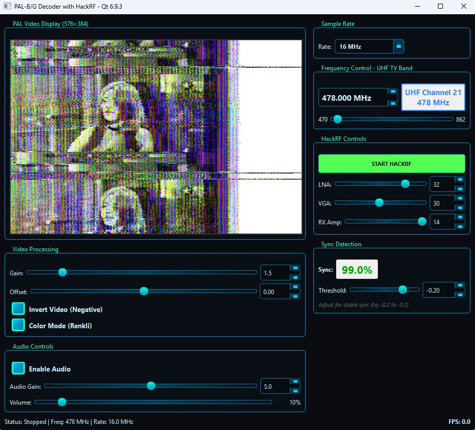

# PAL-B/G Color Decoder - Qt 6 C++ Project

Real-time PAL-B/G color television decoder for HackRF SDR with full audio support.



## Features

- ✅ **Full Color PAL Decoding** - 4.43 MHz color subcarrier demodulation
- ✅ **PAL Comb Filter** - V-phase alternation with delay line
- ✅ **Audio Support** - FM demodulation at 5.5 MHz, 48 kHz output
- ✅ **Real-time Processing** - 25 fps, ~50ms latency
- ✅ **Adjustable Controls** - Video gain, offset, sync threshold, audio gain
- ✅ **Color/B&W Toggle** - Switch between color and grayscale
- ✅ **Frequency Tuning** - UHF band (470-862 MHz)
- ✅ **HackRF Integration** - Native 16 MHz I/Q sampling

## Requirements

- **Qt 6** (tested with 6.9.3)
- **C++17** compiler
- **HackRF One** SDR hardware
- **Windows/Linux/macOS**

## Building

### Qt Creator:
1. Open `PALBDecoder.pro`
2. Configure for Qt 6
3. Build → Run

### Command Line:
```bash
qmake PALBDecoder.pro
make
./PALBDecoder
```

## Quick Start

1. Connect HackRF One
2. Launch application
3. Click "Start HackRF"
4. Tune to PAL-B channel (e.g., 478 MHz for Turkish E21)
5. Adjust video gain and sync threshold

## Signal Processing Chain

### Video Path (16 MHz → 576×384 RGB)
```
HackRF I/Q → LPF (5.5 MHz) → AM Demod → DC Block → Resample (6 MHz)
    ↓
Luma Filter (3.2 MHz) → Sync Detection → Line Assembly
    ↓
Chroma BPF (4.43 MHz ± 1.5 MHz) → U/V Demodulation → Comb Filter
    ↓
Bilinear Interpolation → YUV→RGB → Frame Buffer → Display
```

### Audio Path (16 MHz → 48 kHz)
```
HackRF I/Q → BPF (5.5 MHz) → FM Demod → LPF (15 kHz) → Resample (48 kHz)
    ↓
Audio Output (Qt Multimedia)
```

## Controls

### Video Controls
| Control | Range | Default | Description |
|---------|-------|---------|-------------|
| Video Gain | 0.1 - 10.0 | 1.5 | Overall brightness |
| Video Offset | -1.0 - 1.0 | 0.0 | Black level |
| Sync Threshold | -1.0 - 0.0 | -0.2 | Sync pulse detection |
| Invert Video | On/Off | Off | Negative image |
| Color Mode | On/Off | On | Color/B&W toggle |

### HackRF Controls
| Control | Range | Default | Description |
|---------|-------|---------|-------------|
| Frequency | 470-862 MHz | 478 MHz | Channel frequency |
| LNA Gain | 0-40 dB | 16 dB | RF amplifier |
| VGA Gain | 0-62 dB | 20 dB | IF amplifier |
| RX Amp | On/Off | Off | Extra 14 dB boost |

### Audio Controls
| Control | Range | Default | Description |
|---------|-------|---------|-------------|
| Enable Audio | On/Off | On | Audio output |
| Audio Gain | 0.0 - 10.0 | 1.0 | Volume |

## Color Decoding

### PAL Color System
- **Subcarrier**: 4.43361875 MHz
- **Bandwidth**: ±1.5 MHz
- **Modulation**: QAM (U: 0°, V: 90°/270°)
- **V-Phase**: Alternates every line (PAL = Phase Alternating Line)

### Implementation
```cpp
// U demodulation (0° phase)
U = chromaSignal * cos(2π * 4.43MHz * t)

// V demodulation (90°/270° phase, alternating)
V = chromaSignal * sin(2π * 4.43MHz * t) * (line_odd ? -1 : 1)

// Comb filter (combines adjacent lines)
U_out = (U_current + U_previous) / 2
V_out = (V_current - V_previous) / 2  // V inverts every line

// YUV to RGB conversion
R = Y + 1.140 * V
G = Y - 0.396 * U - 0.581 * V
B = Y + 2.029 * U
```

## PAL-B Channel Frequencies (Turkey)

| Channel | Frequency | Channel | Frequency |
|---------|-----------|---------|-----------|
| E5 | 174 MHz | E21 | 478 MHz |
| E6 | 182 MHz | E22 | 486 MHz |
| E7 | 190 MHz | E23 | 494 MHz |
| E8 | 198 MHz | E24 | 502 MHz |
| E9 | 206 MHz | ... | ... |
| E10 | 214 MHz | E60 | 790 MHz |

## File Structure

```
PALBDecoder/
├── PALDecoder.pro           # Qt project file
├── main.cpp                 # Entry point
├── MainWindow.h/cpp         # UI and HackRF control
├── PALDecoder.h/cpp         # Video signal processing
├── AudioDemodulator.h/cpp   # Audio FM demodulation
├── AudioOutput.h/cpp        # Audio playback
├── FrameBuffer.h            # Frame buffering
├── hacktvlib.h              # HackRF interface
├── paldecoder.jpg           # Screenshot
└── README.md                # This file
```

## Technical Specifications

### Video Output
- **Resolution**: 576×384 pixels
- **Format**: RGB32
- **Frame Rate**: 25 fps
- **Color Space**: YUV → RGB
- **Aspect Ratio**: 4:3

### Audio Output
- **Sample Rate**: 48 kHz
- **Format**: 16-bit float
- **Channels**: Mono
- **Modulation**: FM (deviation: 50 kHz)

### Processing
- **Input Sample Rate**: 16 MHz (I/Q)
- **Video Sample Rate**: 6 MHz (after decimation)
- **Line Frequency**: 15625 Hz
- **Lines per Frame**: 625 (576 visible)
- **CPU Usage**: 10-20% (modern CPU)
- **Memory**: ~100 MB

## Advanced Features

### PAL Comb Filter
Combines two adjacent lines to reduce color noise:
- Stores previous line's U/V values
- Averages with current line (U stays same phase)
- Subtracts for V (phase alternates)
- Reduces chrominance crosstalk

### Bilinear Interpolation
Smooth chroma upsampling:
```cpp
U(x) = U[i] + (U[i+1] - U[i]) * frac
V(x) = V[i] + (V[i+1] - V[i]) * frac
```

### Sync Detection
PLL-based horizontal sync:
- Detects sync pulses (threshold: -0.2)
- Tracks expected sync position (384 samples)
- Auto-corrects timing drift
- Confidence tracking (0.0 - 1.0)

## Troubleshooting

### No Video
1. Check HackRF connection
2. Verify frequency (try 478 MHz)
3. Increase LNA/VGA gains
4. Check antenna connection

### Weak Color
1. Increase chroma gain in code
2. Adjust sync threshold
3. Check signal strength (use `hackrf_transfer`)

### No Audio
1. Enable "Enable Audio" checkbox
2. Increase audio gain
3. Check system audio settings
4. Verify 5.5 MHz audio carrier present

### Image Rolling
1. Adjust Sync Threshold (-0.15 to -0.25)
2. Increase Video Gain
3. Check signal quality

## Performance Tips

- **Release Build**: 3-4x faster than Debug
- **Compiler Flags**: `-O3 -march=native`
- **Thread Affinity**: Set HackRF callback to isolated core
- **Filter Optimization**: Reduce tap count if CPU limited

## License

Educational and commercial use allowed. No warranty provided.

## Credits

- **PAL Standard**: CCIR System B/G
- **Framework**: Qt 6
- **SDR**: HackRF One (Great Scott Gadgets)
- **Signal Processing**: Custom FIR filters, AM/FM demodulation
- **Color Decoding**: PAL comb filter with V-phase alternation

## References

- PAL-B/G Technical Standard (ITU-R BT.470)
- HackRF One Documentation
- Qt Multimedia Framework
- Digital Signal Processing Fundamentals

---

**Version**: 2.0 (Color + Audio)  
**Last Updated**: January 2026
