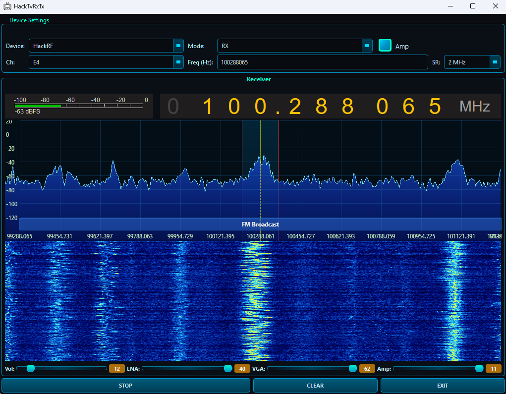
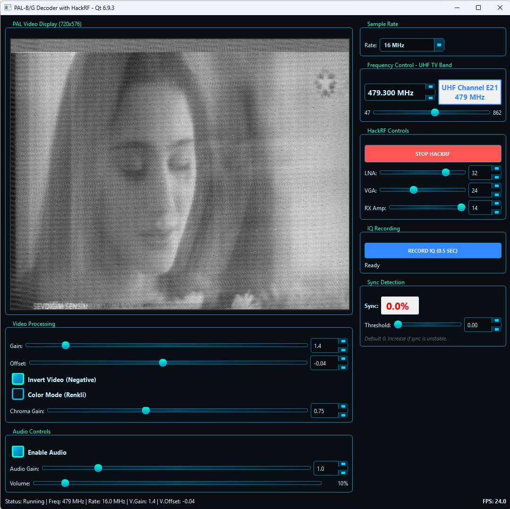
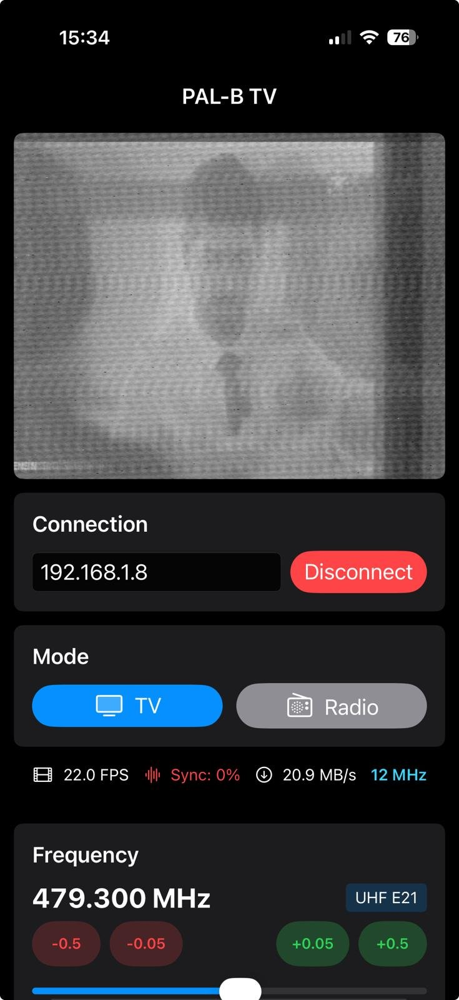
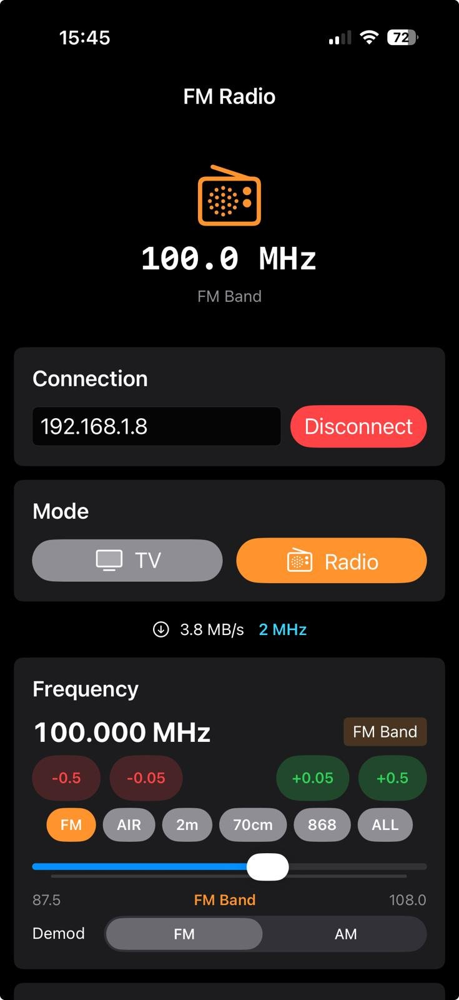
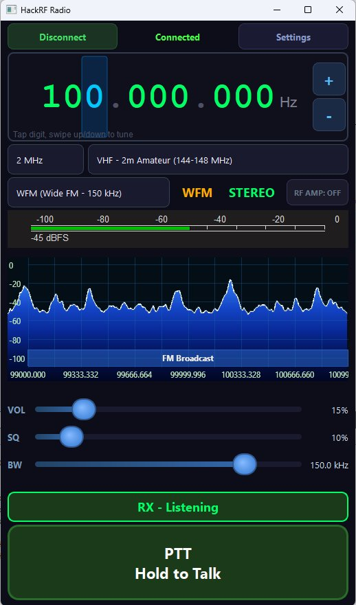

# HackTvRxTx - SDR Transceiver & Analog TV Decoder

A Qt 6.x based SDR (Software Defined Radio) application for HackRF One and RTL-SDR devices. Includes wideband FM receiver with real-time FFT spectrum analyzer, waterfall display, FM stereo transmitter (mic & file), analog TV PAL B/G transmitter, and a standalone PAL-B/G TV decoder with real-time FM audio demodulation.

Based on [fsphil/hacktv](https://github.com/fsphil/hacktv) with significant modifications for cross-platform GUI operation.



## Features

### HackTvGui - SDR Transceiver
- **RX Mode**: Wideband FM receiver with real-time audio demodulation
- **TX Mode**: Analog TV transmitter supporting PAL-I, PAL-B/G, PAL-D/K, PAL-M, PAL-N, SECAM-L, SECAM-D/K, NTSC-M, NTSC-A and more
- **FM Stereo Transmitter (Mic)**: Real-time microphone input FM stereo transmitter with 19 kHz pilot tone and 38 kHz DSB-SC subcarrier per FM broadcasting standard
- **FM Stereo Transmitter (File)**: Audio file playback FM stereo transmitter — supports WAV, MP3, FLAC, OGG, AAC, WMA, M4A and video files (audio track extracted). FFmpeg-based decoding with stereo MPX composite generation
- **FM Stereo MPX**: Full FM stereo multiplex signal generation — (L+R) mono-compatible baseband, 19 kHz pilot tone, (L-R)×sin(38 kHz) subcarrier, 75µs pre-emphasis applied per-channel. MPX composite generated directly at TX sample rate (no intermediate resampler) for maximum efficiency
- **USB Hard Reset**: Physical HackRF USB device reset via `hackrf_reset()` — device detaches and re-enumerates on the USB bus (equivalent to physical unplug/replug). Accessible via the HARD RESET button in the GUI
- **OpenGL Spectrum Analyzer**: GPU-accelerated FFT spectrum display with smooth antialiased rendering
- **Waterfall Display**: Real-time scrolling waterfall with SDR#-style color palette (dark blue → cyan → yellow → red)
- **Band Overlay**: Known frequency band allocations displayed on spectrum (FM Broadcast, Ham Radio, Aviation, Marine VHF, TV bands, Cellular, ISM/WiFi, etc.)
- **Frequency Control**: Click-to-tune on spectrum, mouse wheel tuning with digit-proportional step size, draggable filter bandwidth
- **Adjustable Gains**: LNA, VGA, TX Amp, RX Amp with real-time control
- **Multiple Sample Rates**: 2, 4, 8, 10, 12.5, 16, 20 MHz
- **European TV Channels**: Pre-configured E2-E69 channel list
- **Video Input Sources**: File (MP4/FLV), test pattern, RTSP stream via FFmpeg
- **Fixed Window Size**: 1024×740 fixed layout for consistent UI across all modes
- **Cross-platform**: Windows (MinGW 64-bit) and macOS

### PALBDecoder - Analog TV Receiver
- **PAL-B/G Video Decoder**: Real-time analog TV reception and decoding at 720x576 resolution with SDRangel-style sync detection
- **Dynamic Sample Rate**: Selectable 12.5, 16, 20 MHz — all timing, filters, and decimation chains automatically recalculated per rate
- **Full TV Band Coverage**: VHF Band I (E2-E4, 47-68 MHz), VHF Band III (E5-E12, 174-230 MHz), UHF Band IV/V (E21-E69, 470-862 MHz) with automatic video carrier offset calculation per channel
- **Video Processing**: Adjustable gain, offset, chroma gain, video inversion, color/monochrome mode with automatic AGC
- **Flywheel Sync Detection**: SDRangel-style horizontal sync with fractional zero-crossing detection, flywheel error tracking, and combined quality metric (detection rate + error magnitude). Real-time sync quality percentage display
- **FM Audio Demodulation**: Narrowband FM audio demod pipeline — frequency shift to baseband, complex IQ decimation, narrowband FM demod at ~160 kHz, multi-stage decimation to 48 kHz output. Automatic Nyquist check disables audio when carrier exceeds bandwidth. Adjustable audio gain and volume controls
- **IQ Recording**: Record raw int8 IQ data to file (0.5 second capture) for offline analysis
- **HackRF Integration**: Direct HackRF One control with LNA, VGA, and RX Amp gain settings
- **Multi-threaded Processing**: Separate thread pool for video and audio demodulation with atomic frame-skip guards for video and continuous processing for audio



### PALBDecoderIOS - Mobile TV Receiver
- **iOS/macOS Port**: Native Swift/Qt port of PALBDecoder for iPhone and iPad
- **Network Streaming**: Connects to HackRF TCP IQ Server (HackRfTcp) over WiFi — no USB connection needed on the mobile device
- **TV & Radio Modes**: PAL-B/G video decoding and FM radio demodulation
- **Real-time Stats**: FPS, sync quality, data rate, and sample rate display
- **Channel Selection**: UHF/VHF European TV channel presets with fine-tuning controls
- **Optimized DSP**: Separate I/Q FIR filters, NCO lookup table, fast magnitude approximation, 15-tap video FIR, decimation factor 2 at 12.5 MHz for efficient mobile performance

<p align="center">
  
  &nbsp;&nbsp;&nbsp;&nbsp;
  
</p>

### HackRfRadio - TCP Remote SDR Radio

A standalone Qt 6.x radio client that connects to HackRfTcp over TCP/IP, enabling remote SDR operation from any device on the network. Designed for both desktop and touch-friendly mobile-style interfaces.

- **FM Stereo Decode**: Real-time 19 kHz pilot tone detection via Goertzel algorithm, PLL-based 38 kHz subcarrier recovery, L/R channel separation — true stereo FM broadcast reception
- **Stereo Indicator**: Live STEREO/MONO status display with click-to-toggle forced mono mode
- **Multiple Modulations**: WFM (Wide FM), NFM (Narrow FM), AM demodulation
- **Spectrum Analyzer**: Real-time FFT spectrum display (CPlotter) with SDRuno-style gradient fill, band overlay, adaptive frequency labels
- **Signal Meter**: CMeter dBFS bar with real-time level tracking
- **Remote Operation**: Connects to HackRfTcp server over WiFi/LAN — HackRF can run on a Raspberry Pi while the radio client runs on any PC
- **Adjustable Parameters**: VGA, LNA, RX Gain, IF Bandwidth, Modulation Index, De-emphasis — all settings auto-saved and restored
- **PTT Transmit**: Push-to-talk FM transmit via microphone with real-time audio streaming to server
- **Bandwidth Selection**: 2, 4, 8, 10, 12.5, 16, 20 MHz sample rates
- **Band Presets**: VHF/UHF amateur, FM broadcast, marine, PMR446, CB and custom frequencies
- **Low-latency Audio**: Dedicated writer thread with stereo output, buffer priming, and QAudioSink volume control for instant response



## Architecture

### PAL-B/G Audio Demodulation Pipeline

```
HackRF IQ (16 MHz)
       │
       ▼
┌──────────────────────────────────────────────────────────┐
│  Frequency Shift: carrier (5.5 MHz + tune offset) → DC  │
│  Complex IQ, NCO with persistent phase                   │
└──────────────────────────────────────────────────────────┘
       │
       ▼
┌──────────────────────────────────────────────────────────┐
│  Complex IQ Decimation (narrowband filtering)            │
│  Stage 0: 16 MHz → 1.6 MHz (÷10, 33-tap FIR)          │
│  Stage 1: 1.6 MHz → 160 kHz (÷10, 33-tap FIR)         │
│  Anti-alias filter applied to I and Q separately         │
└──────────────────────────────────────────────────────────┘
       │
       ▼
┌──────────────────────────────────────────────────────────┐
│  FM Demodulation (atan2 phase difference)                │
│  Narrowband signal at 160 kHz — clean FM demod           │
│  Output: scaled phase delta (×0.3)                       │
└──────────────────────────────────────────────────────────┘
       │
       ▼
┌──────────────────────────────────────────────────────────┐
│  Real-valued Decimation                                   │
│  Stage 2: 160 kHz → 53.3 kHz (÷3, 17-tap FIR)         │
│  Resample: 53.3 kHz → 48 kHz (linear interpolation)     │
│  Final: 15 kHz bandwidth filter at 48 kHz                │
└──────────────────────────────────────────────────────────┘
       │
       ▼
  Audio Output (48 kHz, 16-bit stereo, 10ms chunks)
```

The decimation chain is dynamically computed by `rebuildDecimationChain()` when the sample rate changes. At each stage, the algorithm greedily selects the largest safe integer decimation factor. Complex IQ decimation runs before FM demod (critical — FM demod on wideband signal produces noise), then remaining stages run on the real-valued demodulated audio.

### FM Transmitter Audio Pipeline

```
┌─────────────────────────────────────────────────────────────────┐
│  Audio Sources                                                   │
│                                                                  │
│  Microphone ──► PortAudioInput (mono 44.1kHz)                   │
│                    │                                             │
│                    ▼                                             │
│              Mono→Stereo (L=R) ──► Ring Buffer (1M float SPSC)  │
│                                          ▲                      │
│  Audio File ──► FFmpeg Decode ──► Stereo 44.1kHz ───┘           │
│  (MP3/WAV/      (swresample)      (L,R interleaved)            │
│   FLAC/OGG)                                                     │
└─────────────────────────────────────────────────────────────────┘
                              │
                              ▼
┌─────────────────────────────────────────────────────────────────┐
│  FM Stereo MPX Generator (StereoMPXGenerator)                   │
│                                                                  │
│  Input: Stereo L,R @ 44.1kHz                                    │
│                                                                  │
│  ┌──────────┐   ┌──────────────────────────────────────┐        │
│  │ L channel├──►│ 75µs Pre-emphasis ──► L'             │        │
│  │ R channel├──►│ 75µs Pre-emphasis ──► R'             │        │
│  └──────────┘   └──────────────────────────────────────┘        │
│                           │                                      │
│                           ▼                                      │
│  ┌──────────────────────────────────────────────────────┐       │
│  │  Linear Interpolation: 44.1kHz → TX Sample Rate     │       │
│  │  (e.g. 2 MHz — direct upsample, no resampler)       │       │
│  └──────────────────────────────────────────────────────┘       │
│                           │                                      │
│                           ▼                                      │
│  MPX Composite @ TX Rate:                                        │
│    0.45×(L'+R') + 0.075×sin(19kHz) + 0.45×(L'-R')×sin(38kHz)  │
│    ──────────    ────────────────    ──────────────────────────  │
│    Mono (L+R)    Pilot Tone         Stereo Subcarrier (DSB-SC)  │
└─────────────────────────────────────────────────────────────────┘
                              │
                              ▼
┌─────────────────────────────────────────────────────────────────┐
│  FM Modulator (FrequencyModulator)                               │
│                                                                  │
│  MPX baseband → Phase modulation → IQ output                    │
│  Persistent phase state across TX callbacks                      │
│  Pre-emphasis disabled (handled by MPX generator)                │
│                                                                  │
│  Output: Complex IQ @ TX Sample Rate → HackRF USB Transfer      │
└─────────────────────────────────────────────────────────────────┘
```

### Ring Buffer Design

The audio pipeline uses a lock-free single-producer single-consumer (SPSC) ring buffer (1M float samples ≈ 11 seconds stereo @ 44.1kHz) shared between the audio source thread and the HackRF TX callback:

- **Producer** (audio thread): PortAudioInput callback or AudioFileInput decode thread writes stereo interleaved float samples via `ringWrite()`
- **Consumer** (TX callback): `apply_fm_modulation()` reads stereo samples via `ringRead()`, feeds to MPX generator
- **Back-pressure**: File decode blocks when ring buffer is full (`ringFree() < 256`), naturally pacing decode speed to TX consumption rate
- **No timing dependency**: TX hardware callback is the master clock — no `sleep_for` pacing needed

## Project Structure

```
HackTvRxTx/
├── HackTvLib/             # Shared library (DLL/dylib) - core SDR engine
│   ├── hacktvlib.cpp/h    # Main library interface
│   ├── hackrfdevice.cpp/h # HackRF One device driver + ring buffer + FM TX
│   ├── rtlsdrdevice.cpp/h # RTL-SDR device driver
│   ├── audioinput.h       # Microphone input (PortAudio → ring buffer)
│   ├── audiofileinput.h   # Audio file input (FFmpeg → ring buffer)
│   ├── modulation.h       # StereoMPXGenerator, FrequencyModulator, RationalResampler
│   ├── stream_tx.h        # Legacy double-buffer (used by video TX mode)
│   └── hacktv/            # Video encoding, modulation, RF output
├── HackTvGui/             # Main SDR transceiver GUI application
│   ├── mainwindow.cpp/h   # Main application window
│   ├── glplotter.cpp/h    # OpenGL spectrum analyzer & waterfall
│   ├── freqctrl.cpp/h     # Frequency digit display widget
│   ├── meter.cpp/h        # Signal level meter widget
│   ├── audiooutput.cpp/h  # Audio playback engine
│   └── modulator.h        # FM/AM modulation DSP (RX side)
├── PALBDecoder/           # Standalone PAL-B/G TV decoder application
│   ├── MainWindow.cpp/h   # Decoder GUI with video display & HackRF control
│   ├── PALDecoder.cpp/h   # PAL video decoding engine (sync, AGC, color)
│   ├── audiodemodulator.*  # FM audio demodulator (dynamic decimation chain)
│   ├── audiooutput.cpp/h  # Audio playback engine (48 kHz, FFmpeg backend)
│   └── FrameBuffer.h      # IQ frame accumulator (40ms PAL frames)
├── PALBDecoderIOS/        # iOS/macOS mobile TV decoder (connects via WiFi)
├── HackRfTcp/             # HackRF TCP IQ Server (headless, runs on Raspberry Pi)
│   ├── main.cpp           # Server entry point
│   └── sdrdevice.cpp/h    # TCP streaming IQ server (data port + control port)
├── HackRfRadio/           # TCP Remote SDR Radio Client
│   ├── radiowindow.cpp/h  # Main radio GUI (spectrum, meter, PTT, controls)
│   ├── fmdemodulator.cpp/h # FM demodulator with stereo decode (pilot PLL, 38kHz subcarrier)
│   ├── amdemodulator.cpp/h # AM envelope demodulator
│   ├── audioplayback.cpp/h # Stereo audio output (dedicated writer thread)
│   ├── audiocapture.cpp/h # Microphone capture for PTT transmit
│   ├── tcpclient.cpp/h    # TCP client (IQ data + control + audio channels)
│   ├── frequencywidget.cpp/h # Touch-friendly frequency digit display
│   ├── gainsettingsdialog.* # Gain & TX parameters dialog
│   ├── glplotter.cpp/h    # OpenGL spectrum analyzer (from HackTvGui)
│   ├── meter.cpp/h        # Signal level meter (from HackTvGui)
│   └── constants.h        # FFT, frequency macros, gain limits
├── include/               # Shared headers
└── lib/                   # Pre-built libraries (windows/macos/linux)
```

## Supported Hardware

| Device | RX | TX | Notes |
|--------|----|----|-------|
| HackRF One | Yes | Yes | Full duplex, 1 MHz - 6 GHz |
| RTL-SDR | Yes | No | RX only, various tuner chips |

## Requirements

- Qt 6.x (6.5+ recommended, tested up to 6.10)
- C++17 compiler
- MinGW 64-bit (Windows) or Clang/GCC (macOS/Linux)
- MSYS2 (Windows only, for dependencies)

## Build Instructions

### Windows

**1. Install MSYS2** from https://www.msys2.org/

**2. Install dependencies** in MSYS2 MINGW64 terminal:

```bash
pacman -Syu
pacman -S --needed \
  mingw-w64-x86_64-gcc \
  mingw-w64-x86_64-gcc-libs \
  mingw-w64-x86_64-ffmpeg \
  mingw-w64-x86_64-libusb \
  mingw-w64-x86_64-hackrf \
  mingw-w64-x86_64-rtl-sdr \
  mingw-w64-x86_64-fdk-aac \
  mingw-w64-x86_64-fftw \
  mingw-w64-x86_64-portaudio \
  mingw-w64-x86_64-opus \
  mingw-w64-x86_64-x264 \
  mingw-w64-x86_64-x265 \
  mingw-w64-x86_64-zlib \
  mingw-w64-x86_64-bzip2 \
  mingw-w64-x86_64-xz
```

**3. Add MSYS2 to PATH:**

Add `C:\msys64\mingw64\bin` to your system PATH environment variable.

**4. Build HackTvLib first:**

Open `HackTvLib/HackTvLib.pro` in Qt Creator with Desktop Qt 6.x MinGW 64-bit kit, build. The library files are automatically copied to the `lib/` folder.

**5. Build HackTvGui:**

Open `HackTvGui/HackTvGui.pro` in Qt Creator, build and run.

**6. Build PALBDecoder (optional):**

Open `PALBDecoder/PALBDecoder.pro` in Qt Creator, build and run.

### macOS

Install dependencies via Homebrew:

```bash
brew install hackrf libusb ffmpeg fftw portaudio opus x264 x265
```

Open the `.pro` files in Qt Creator with Desktop Qt 6.x kit and build. Qt 6.x desktop kit works out of the box.

### Linux

```bash
sudo apt install libhackrf-dev libusb-1.0-0-dev librtlsdr-dev \
  libavcodec-dev libavformat-dev libavutil-dev libswresample-dev \
  libfftw3-dev libportaudio-ocaml-dev libopus-dev
```

### Raspberry Pi (Debian Bookworm, aarch64)

Raspberry Pi OS minimal images don't include `-dev` packages. All dependencies must be built from source.

**1. Install base build tools:**

```bash
sudo apt update && sudo apt upgrade -y
sudo apt install build-essential cmake autoconf automake libtool pkg-config git qt6-base-dev qt6-multimedia-dev
```

**2. Build libusb (header + pkg-config):**

```bash
cd /tmp
git clone https://github.com/libusb/libusb.git
cd libusb
./autogen.sh && ./configure && make
sudo make install && sudo ldconfig
```

**3. Build libhackrf:**

```bash
cd /tmp
git clone https://github.com/greatscottgadgets/hackrf.git
cd hackrf && git checkout v2024.02.1
cd host && mkdir build && cd build
cmake ../libhackrf
make && sudo make install && sudo ldconfig
```

**4. Build PortAudio:**

```bash
cd /tmp
git clone https://github.com/PortAudio/portaudio.git
cd portaudio && cmake -B build && cmake --build build
sudo cmake --install build && sudo ldconfig
```

**5. Build FFTW3 (float):**

```bash
cd /tmp
wget http://www.fftw.org/fftw-3.3.10.tar.gz
tar xzf fftw-3.3.10.tar.gz && cd fftw-3.3.10
./configure --enable-float --enable-shared --prefix=/usr/local
make -j4 && sudo make install && sudo ldconfig
```

**6. Build Opus:**

```bash
cd /tmp
git clone https://github.com/xiph/opus.git
cd opus && mkdir build && cd build
cmake .. -DBUILD_SHARED_LIBS=ON
make -j4 && sudo make install && sudo ldconfig
```

**7. Build FDK-AAC:**

```bash
cd /tmp
git clone https://github.com/mstorsjo/fdk-aac.git
cd fdk-aac && mkdir build && cd build
cmake .. -DBUILD_SHARED_LIBS=ON
make -j4 && sudo make install && sudo ldconfig
```

**8. Build RTL-SDR:**

```bash
cd /tmp
git clone https://github.com/osmocom/rtl-sdr.git
cd rtl-sdr && mkdir build && cd build
cmake .. && make && sudo make install && sudo ldconfig
```

**9. Install FFmpeg dev (if not available via apt):**

```bash
sudo apt install libavformat-dev libavcodec-dev libavutil-dev libswresample-dev libswscale-dev libavdevice-dev libavfilter-dev
```

If apt packages are unavailable, build from source:

```bash
cd /tmp
git clone https://git.ffmpeg.org/ffmpeg.git
cd ffmpeg
./configure --enable-shared --disable-static --prefix=/usr/local
make -j4 && sudo make install && sudo ldconfig
```

**10. Build HackTvLib:**

```bash
cd HackTvLib
qmake6 HackTvLib.pro
make
```

**11. Build HackRfTcp:**

```bash
cd HackRfTcp
qmake6 HackRfTcp.pro
make
```

**12. Run:**

```bash
export LD_LIBRARY_PATH=$(pwd)/../lib/linux:$LD_LIBRARY_PATH
./HackRfTcp
```

**13. Install as systemd service (optional):**

```bash
sudo tee /etc/systemd/system/hackrftcp.service << 'EOF'
[Unit]
Description=HackRF TCP IQ Server
After=network.target

[Service]
ExecStart=/home/pi/HackRf/HackRfTcp/HackRfTcp
WorkingDirectory=/home/pi/HackRf/HackRfTcp
Environment=LD_LIBRARY_PATH=/home/pi/HackRf/lib/linux
User=root
Restart=on-failure
RestartSec=5

[Install]
WantedBy=multi-user.target
EOF

sudo systemctl daemon-reload
sudo systemctl enable hackrftcp.service
sudo systemctl start hackrftcp.service
```

Monitor the service:

```bash
sudo journalctl -u hackrftcp.service -f
```

> **Note:** HackRF One draws significant USB current. Use a powered USB hub or a 5V/5A power supply to avoid undervoltage issues on the Raspberry Pi.

## Supported TV Modes (TX)

| Mode | Lines | FPS | Audio |
|------|-------|-----|-------|
| PAL-I | 625 | 25 | 6.0 MHz FM |
| PAL-B/G | 625 | 25 | 5.5 MHz FM |
| PAL-D/K | 625 | 25 | 6.5 MHz FM |
| PAL-FM | 625 | 25 | 6.5 MHz FM |
| PAL-N | 625 | 25 | 4.5 MHz AM |
| PAL-M | 525 | 30 | 4.5 MHz FM |
| SECAM-L | 625 | 25 | 6.5 MHz AM |
| SECAM-D/K | 625 | 25 | 6.5 MHz FM |
| NTSC-M | 525 | 29.97 | 4.5 MHz FM |

## FM Transmitter Modes

| Mode | Input | Stereo | Description |
|------|-------|--------|-------------|
| FM Transmitter Mic | Microphone | Yes (dual mono) | Real-time voice/audio transmission via default audio input device |
| FM Transmitter File | Audio/Video file | Yes (true stereo) | File playback transmission — FFmpeg decodes any format, stereo channels preserved in MPX |

Both modes generate a standard FM stereo MPX composite signal with 19 kHz pilot tone, enabling any FM stereo receiver to decode separate left and right channels.

## License

Based on [hacktv](https://github.com/fsphil/hacktv) by Philip Heron. See individual source files for license details.
