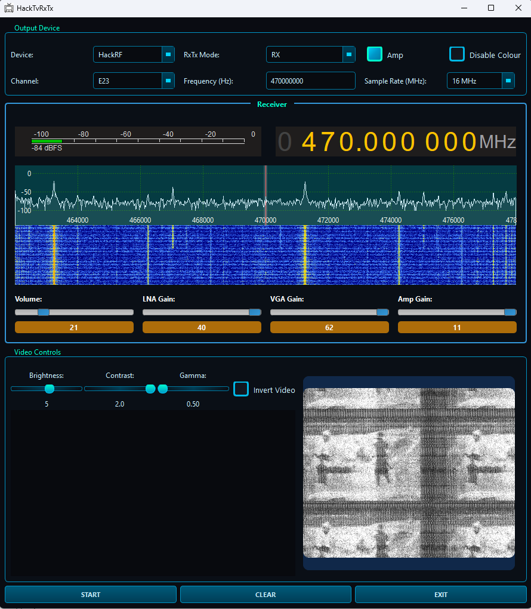

# HackTvRxTx QT 6.x Library And Gui Project

This project is a clone of https://github.com/fsphil/hacktv with modifications for building on Windows. 

Now macos supported.

Enabled Rx and Tx Mode. Video and FM Transmitter & FFt spectrum

<b>Please compile for windows with Desktop Qt 6.x MinGW 64-bit

For macos qt.6.x desktop works.</b>

HackTvLib creates library (HackTvLib.dll, libHackTvLib.a) for windows gui.
HackTvLib creates library (libHackTvLib.1.0.0.dylib, libHackTvLib.1.0.dylib, libHackTvLib.1.dylib, libHackTvLib.dylib) for macos gui.
You can compile HackTvGui with these libraries, they will be automaticaly copied to project Lib folder when you compile HackTvLib.



## Installation Instructions

### 1. Install MSYS2

Download and install MSYS2 from: https://www.msys2.org/

### 2. Install Dependencies

Open MSYS2 and run the following commands:

```bash
pacman -Syu
pacman -S mingw-w64-x86_64-ffmpeg \
             mingw-w64-x86_64-libusb \
             mingw-w64-x86_64-hackrf \
             mingw-w64-x86_64-rtl-sdr \
             mingw-w64-x86_64-fdk-aac \
             mingw-w64-x86_64-fftw \
             mingw-w64-x86_64-portaudio \
             mingw-w64-x86_64-opus
```

### 3. Set up PKG_CONFIG_PATH

```bash
export PKG_CONFIG_PATH=/mingw64/lib/pkgconfig:$PKG_CONFIG_PATH
```
